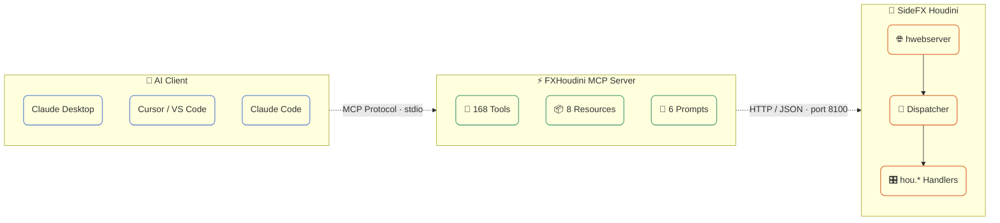

# :material-home:{.scale-in-center} Home

## fxhoudinimcp

The most comprehensive [MCP](https://modelcontextprotocol.io/) (Model Context Protocol) server for [SideFX Houdini](https://www.sidefx.com/).

**173 tools**, **8 resources**, and **6 workflow prompts** out of the box.

Connects AI assistants like Claude directly to Houdini's Python API, enabling natural language control over scene building, simulation setup, rendering, and more.

## Features

| Category | Tools | Description |
|----------|-------|-------------|
| **Scene Management** | 8 | Open, save, import/export, scene info, connection status |
| **Node Operations** | 16 | Create, delete, copy, connect, layout, flags |
| **Parameters** | 10 | Get/set values, expressions, keyframes, spare parameters |
| **Geometry (SOPs)** | 12 | Points, prims, attributes, groups, sampling, nearest-point search |
| **LOPs/USD** | 18 | Stage inspection, prims, layers, composition, variants, lighting |
| **DOPs** | 8 | Simulation info, DOP objects, step/reset, memory usage |
| **PDG/TOPs** | 10 | Cook, work items, schedulers, dependency graphs |
| **COPs (Copernicus)** | 7 | Image nodes, layers, VDB data |
| **HDAs** | 10 | Create, install, manage Digital Assets and their sections |
| **Animation** | 9 | Keyframes, playbar control, frame range |
| **Rendering** | 9 | Viewport capture, render nodes, settings, render launch |
| **VEX** | 5 | Create/edit wrangles, validate VEX code |
| **Code Execution** | 4 | Python, HScript, expressions, env variables |
| **Viewport/UI** | 10 | Pane management, screenshots, error detection |
| **Scene Context** | 8 | Network overview, cook chain, selection, scene summary, error analysis |
| **Workflows** | 8 | One-call Pyro/RBD/FLIP/Vellum setup, SOP chains, render config |
| **Materials** | 4 | List, inspect, create materials and shader networks |
| **CHOPs** | 4 | Channel data, CHOP nodes, export channels to parameters |
| **Cache** | 4 | List, inspect, clear, write file caches |
| **Takes** | 4 | List, create, switch takes with parameter overrides |

## Architecture

Uses Houdini's built-in `hwebserver`. No custom socket servers, no rpyc. Uses `hdefereval.executeInMainThreadWithResult()` to safely run `hou.*` calls on the main thread.

## How It Works

1. **Houdini Plugin** (`houdini/`): Runs inside Houdini's Python environment. Registers `@hwebserver.apiFunction` endpoints that receive JSON commands. Uses `hdefereval.executeInMainThreadWithResult()` to safely execute `hou.*` calls on the main thread.

2. **MCP Server** (`python/fxhoudinimcp/`): A standalone Python process using FastMCP. Exposes 173 tools, 8 resources, and 6 prompts via the MCP protocol. Forwards tool calls to Houdini over HTTP.

3. **Bridge** (`python/fxhoudinimcp/bridge.py`): Async HTTP client that sends commands to Houdini's hwebserver and deserializes responses. Handles connection errors and timeouts.
